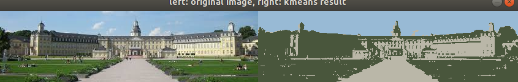
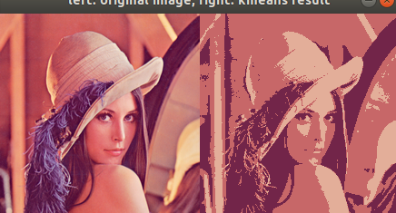
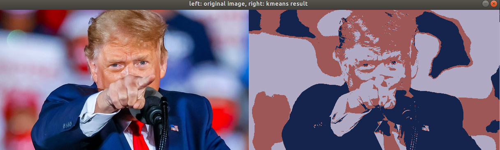

###Machine Vision Chapter1
1.***K-means***
From the struction of main function, user should give 3 arguments namely the data directory, number of clusters and maximum iterations.Then these parameters are parsed into "int k, interations"

~~~C++
Kmeans kmeans(img, k);
~~~
this line instantiates an object of type Kmeans,initializing it with the image and number of clusters. In the initialization step, the images are split into rows*cols pixels and each pixel constructs a "sample" object, which contains the feature(color), position(r,c) and label(-1). The private members centers_ and last_centers_ are resized to k as well.

~~~C++
kmeans.run(iteration, convergence_radius);
~~~
~~~c++
void Kmeans::run(int max_iteration, float smallest_convergence_radius) {
    initialize_centers();
    int current_iter = 0;
    while (!is_terminate(current_iter, max_iteration,
                         smallest_convergence_radius)) {
        current_iter++;
        update_labels();
        update_centers();
    }
}
~~~

While running the algorithm with function"run", centers are initialized randomly and the process"update label, update centers" are executed until either iteration reaches maximum iteration or the distance(RGB space) between centers and last centers are small enough.

~~~c++
void Kmeans::update_labels() {
    for (Sample& sample : samples_) {
        // TODO update labels of each feature
        float minDist = std::numeric_limits<float>::max();
        for(int i = 0; i< centers_.size();i++){
            float curDist = calc_square_distance(sample.feature_, centers_[i].feature_);
            if(curDist < minDist){
                minDist = curDist;
                sample.label_ = i;
            }
        }
    }
}

/**
 * @brief move the centers according to new lables
 *
 */
void Kmeans::update_centers() {
    // backup centers of last iteration
    last_centers_ = centers_;
    for(int i = 0; i < centers_.size();i++){
        centers_[i] = {0.0f,0.0f,0.0f};
    }
    // calculate the mean value of feature vectors in each cluster
    // TODO complete update centers functions.
    std::vector<int> clusterSize_(centers_.size(),0);
    for (int i = 0;i < samples_.size(); i++){
        clusterSize_[samples_[i].label_]++;
    }
    
    for(int i = 0; i < samples_.size(); i++){
        for(int k = 0; k < 3; k++){
            centers_[samples_[i].label_].feature_[k] += samples_[i].feature_[k] / clusterSize_[samples_[i].label_];           
        }
    }
}
~~~
Update labels: traverse each sample, choose the index of the nearest center and save it as its label.
Update centers: traverse every cluster, compute its center as the next center(Thus K-means).Here i count the number of elements each cluster has and traverse all samples, adding its contribution(feature/number, namely weight) to the respective center.

When the stopping criterion is fulfilled, every sample is already labeled and we can reconstruct the clustered image and visualize it.

The following are some results:

    
     
    
Fig1.Building Clustered

    
     
    
Fig2.Lena Clustered

    
     
    
Fig3.Trump Clustered 

